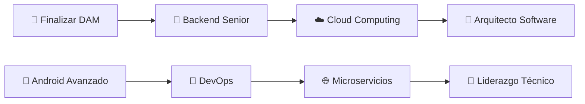

# Raúl López Ricarte

<div align="center">
  
</div>

<div align="center">
  
  [](https://git.io/typing-svg)
  
  **`Desarrollador Web Full Stack Junior`**  
  *Especializado en backend con experiencia en sector financiero*
  
  <br/>
  
  [](https://raullopez20.github.io/PORTAFOLIO_RAUL_LOPEZ)
  [](https://linkedin.com/in/raullopez20r)
  [](mailto:raullopez20r@gmail.com)
  [](link-to-cv)
  
  <br/>
  
  
  
</div>

---

## 👨‍💻 Sobre mí

```javascript
const raulLopez = {
    nombre: "Raúl López Ricarte",
    ubicacion: "Valencia, España 🇪🇸",
    edad: 22,
    
    especialidad: "Backend Development",
    pasion: "Frontend & UX/UI Design",
    
    formacion: {
        actual: "Grado Superior DAM (2023-2025)",
        anterior: "Grado Medio SMR (2021-2023)"
    },
    
    experiencia: {
        "Caja Rural Central": "Técnico IT | Infraestructura & Sistemas",
        "Freelance": "Desarrollador Web | Proyectos institucionales"
    },
    
    filosofia: "El aprendizaje nunca se detiene 🚀",
    estado: "Disponible para nuevos proyectos ✅"
};
```

### 🎯 Actualmente enfocado en:
- **Backend sólido** con Java, Spring Boot y arquitecturas escalables
- **Frontend moderno** con React, Angular y frameworks como Astro
- **Desarrollo multiplataforma** para Android con Kotlin
- **Infraestructura IT** y administración de sistemas empresariales

---

## 🛠️ Stack Tecnológico

<div align="center">

### **Backend & Core**


### **Frontend & UI**


### **Mobile & Tools**


</div>

<details>
<summary><b>📊 Nivel de competencias</b></summary>
<br>

| Tecnología | Nivel | Experiencia |
|:-----------|:------|:------------|
| **Java** | ████████░░ 80% | 1+ años - Desarrollo backend, APIs REST |
| **MySQL** | ███████░░░ 75% | Diseño de BD, consultas complejas |
| **TypeScript** | ███████░░░ 70% | Proyectos frontend con tipado fuerte |
| **TailwindCSS** | ██████░░░░ 65% | Framework CSS para UI moderna |
| **JavaScript** | ██████░░░░ 65% | Desarrollo frontend y backend |
| **React** | ██████░░░░ 60% | SPAs y componentes reutilizables |
| **Kotlin** | █████░░░░░ 55% | Desarrollo Android nativo |
| **Astro** | █████████░ 90% | Framework moderno para sitios estáticos |

</details>

---

## 💼 Experiencia Profesional

<div align="center">
<table>
<tr>
<td align="center" width="50%">

### 🏦 **Caja Rural Central**
**Técnico en Infraestructura IT**  
*Enero 2023 – Junio 2023 | Enero 2025 – Junio 2025*

🔹 **Active Directory** - Administración de usuarios y grupos  
🔹 **Soporte BMS** - Gestión de incidencias críticas  
🔹 **Automatización** - Scripts y mantenimiento  
🔹 **Seguridad** - Gestión de datos sensibles bancarios  

</td>
<td align="center" width="50%">

### 💻 **Freelance Developer**
**Desarrollador Web Full Stack**  
*Marzo 2025 - Junio 2025*

🔹 **Proyecto oficial** para Comparsa Moros Almohábenos  
🔹 **Stack completo:** Astro + React + TypeScript + MySQL  
🔹 **3 meses** de desarrollo completo  
🔹 **GitHub Pages** deployment + SEO optimizado  

</td>
</tr>
</table>
</div>

---

## 🚀 Proyectos Destacados

<div align="center">

### 📝 **Daily Note**
*Aplicación de notas diarias profesional*

**React** • **TypeScript** • **TailwindCSS** • **MySQL** • **Prisma** • **Python**

Aplicación minimalista para tomar notas diarias con funcionalidades avanzadas de organización, búsqueda inteligente y plantillas personalizables para una experiencia de usuario optimizada.

---

### 📁 **GestorDocs**
*Sistema web de gestión de documentación corporativa*

**React** • **Flask** • **Python** • **MySQL** • **Bootstrap 5** • **CSS3**

Sistema profesional para la gestión centralizada de documentación y manuales corporativos, desarrollado con Flask y diseñado con paleta de colores empresarial moderna.

---

### 🏛️ **Web Oficial Moros Almohábenos**
*Sitio web institucional para comparsa*

**Astro** • **React** • **TypeScript** • **TailwindCSS** • **MySQL**

Desarrollo completo incluyendo zona de socios, galería multimedia, calendario de eventos y optimización SEO.

</div>

<div align="center">
  <a href="https://github.com/Raullopez20?tab=repositories">
    
  </a>
</div>

---

## 📊 Estadísticas de GitHub

<div align="center">
  
  
</div>

<div align="center">
  
</div>

<div align="center">
  
</div>

---

## 🎓 Formación & Competencias

<div align="center">
<table>
<tr>
<td width="50%">

### **📚 Formación Académica**
🎯 **Grado Superior DAM** *(2023-2025)*  
*Desarrollo de Aplicaciones Multiplataforma*  
📍 IES Las Espeñetas - Generalitat Valenciana

🔧 **Grado Medio SMR** *(2021-2023)*  
*Sistemas Microinformáticos y Redes*  
📍 IES Las Espeñetas - Generalitat Valenciana

</td>
<td width="50%">

### **💡 Competencias Profesionales**
✅ **Metodologías Ágiles** - Scrum, desarrollo iterativo  
✅ **Resolución de problemas** - Enfoque analítico  
✅ **Trabajo en equipo** - Colaboración efectiva  
✅ **Adaptabilidad** - Aprendizaje continuo  
✅ **Orientación a resultados** - Entrega de calidad  

</td>
</tr>
</table>
</div>

---

## 📈 Objetivos 2025

<div align="center">



**🎯 Corto plazo (2025):**
- Finalizar Grado Superior DAM con excelencia
- Especializarse en Spring Boot y microservicios
- Certificación en AWS/Azure
- Contribuir a proyectos open source

**🚀 Mediano plazo (2025-2026):**
- Rol como Backend Developer en empresa tecnológica
- Dominar arquitecturas cloud nativas
- Liderar proyectos de desarrollo full stack

</div>

---

## 🌟 ¿Por qué trabajar conmigo?

<div align="center">
<table>
<tr>
<td align="center" width="25%">

<br><b>Innovación</b>
<br><small>Siempre busco las mejores soluciones tecnológicas</small>
</td>
<td align="center" width="25%">

<br><b>Colaboración</b>
<br><small>Trabajo efectivo en equipos multidisciplinares</small>
</td>
<td align="center" width="25%">

<br><b>Crecimiento</b>
<br><small>Aprendizaje continuo y adaptación al cambio</small>
</td>
<td align="center" width="25%">

<br><b>Calidad</b>
<br><small>Código limpio, mantenible y bien documentado</small>
</td>
</tr>
</table>
</div>

---

## 📞 Conecta conmigo

<div align="center">

### ¿Tienes un proyecto interesante? ¡Hablemos! 🚀

<br/>

[](https://raullopez20.github.io/PORTAFOLIO_RAUL_LOPEZ)
[](https://linkedin.com/in/raullopez20r)
[](mailto:raullopez20r@gmail.com)
[](https://github.com/Raullopez20)

<br/>

**📍 Ubicación:** Valencia, España  
**📞 Teléfono:** (+34) 622 58 28 12  
**💼 Estado:** Disponible para freelance y oportunidades laborales  

<br/>

> *"El mejor momento para empezar fue ayer. El segundo mejor momento es ahora."*  
> — **Desarrollando el futuro, una línea de código a la vez** ⚡

</div>

---

<div align="center">
  
  
  **⭐ Si te gusta mi trabajo, no olvides darle una estrella a mis repositorios ⭐**
  
  <sub>Hecho con ❤️ usando **Markdown**, **HTML** y mucho **☕**</sub>
  
  
  
</div>
